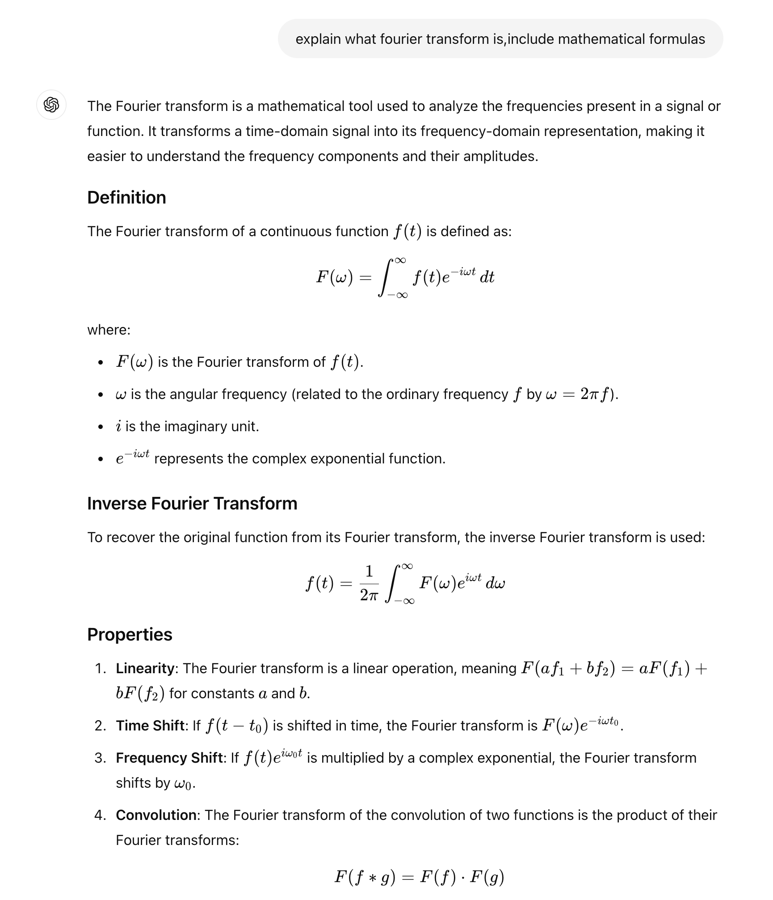
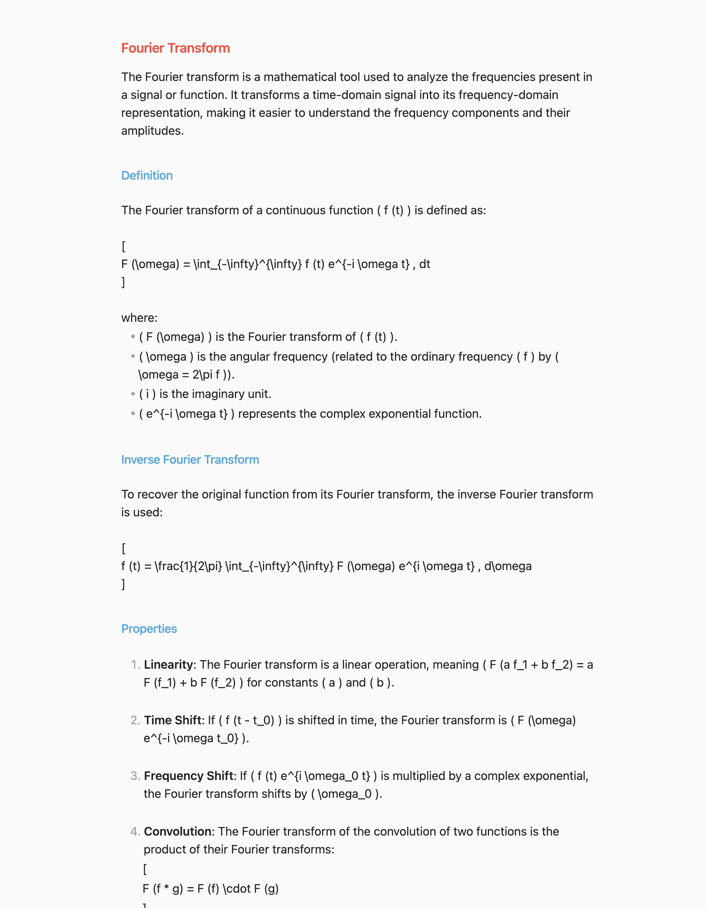
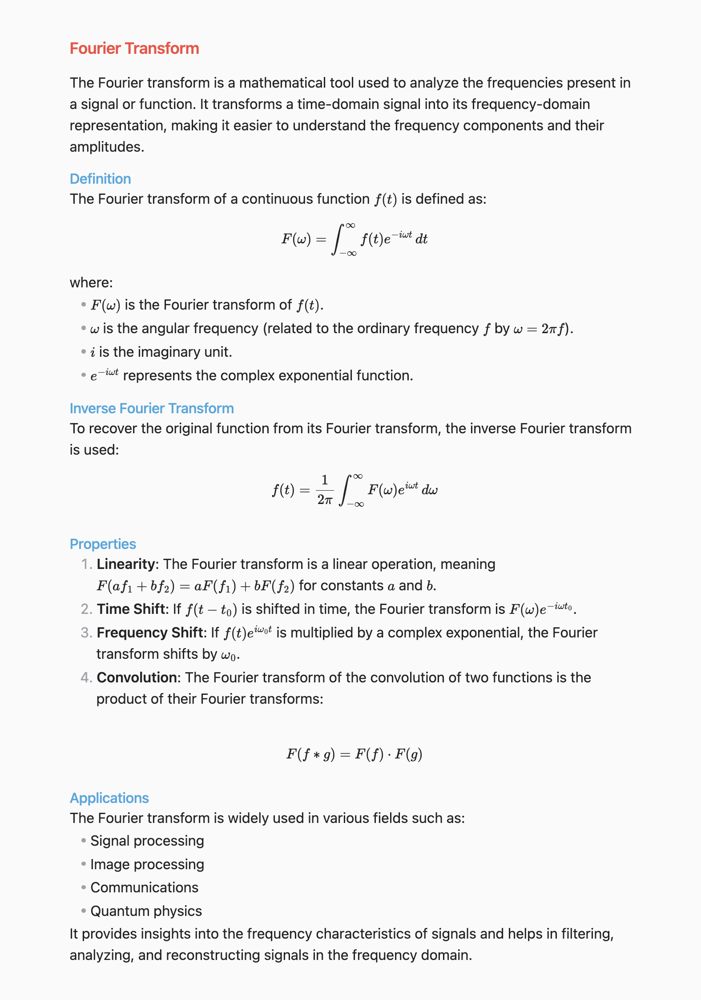

# Markdownfier for ChatGPT

## What is this plugin

When using ChatGPT with Obsidian, you might find that the output format isn't standard Markdown — such as equations being in LaTeX format — which can affect the readability of your documents. This plugin does exactly what its name suggests: it formats ChatGPT's output into Markdown and removes any empty lines.

## Screenshots

### Original Output of ChatGPT 🤩

### Pasted into Obsidian 🥲

### Formatted 💪

## How to use

Run the command "Markdownfier for ChatGPT: Format".